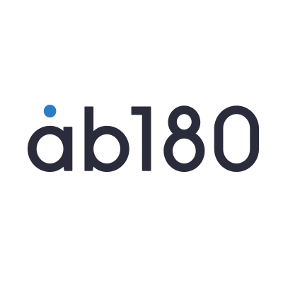

지난번 첫 포스팅에서 말씀드렸다 싶이 저는 ab180에 대해서 관심이 많고, 그 회사에 취업을 하고 싶습니다. 

오늘은 ab180라는 회사에 대해서 소개드리겠습니다.

## ab180, 뭐하는 회사지?
----------------------------

ab180은 앱 사용자들의 데이터를 수집하고 가공하여 고객이 활용하기 가장 손쉬운 형태로 제공하는 애드테크 회사입니다. 애드테크란 말 그대로 광고에 기술을 접목시킨 것으로 디지털 기술을 이용해 광고하는 것을 의미합니다.

air bridge는 고객들이 데이터를 활용한 마케팅 효율화를 통해 빠른 성장을 이뤄낼 수 있도록 그들의 고객이 어디에서 왔는지, 앱에서 어떠한 행동을 하는지 정확하고 의미있는 데이터를 제공하고 있습니다.

## air bridge에서 사용하는 기술
-------------------------------

ab180의 첫 번째 서비스인 에어브릿지의 원천 기술은 웹과 앱, 그리고 데스크탑과 모바일에 파편화된 사용자의 데이터를 하나로 모아주는 크로스플랫폼 매칭 기술이며, 현재 관련한 11개 이상의 기술 라이브로 데이터를 수합하고 있습니다. 

그리고 다음 단계로의 도약을 위해 이렇게 수합된 데이터를 기반으로 새로운 차원의 광고성과 분석기술과 사용자 행동 예측기술을 적용하여 광고상품 출시를 준비 중이라고 합니다.

## 내가 무엇을 해야할까?
----------------------

- es6기반의 React.js와 redux, flux, rxjs에 대해서 깊이 이해하기 
- Webpack, Gulp, Grunt 등의 빌드 툴 사용해보기
- CSS를 능수능란하게 다루기
- Webpack, Gulp, Grunt등의 다양한 빌드 툴 사용해보기
- 블로그 활동 지속적으로 하기
- 1일 1 commit
