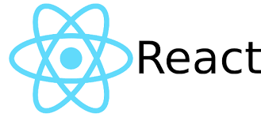

현재 진행하고 있는 CC-Show라는 프로젝트에서 사용하고 있는 라이브러리인 **React.js**에 대해서 소개드리려고 합니다. (CC-Show라는 프로젝트는 추후에 포스팅하겠습니다.)

## React.js란?

React.js는 MVC 프레임워크에서 View부분을 컴포넌트로 만들기 위해서 Facebook이 제작한 UI 라이브러리입니다.

이러한 React.js에는 크게 **세가지 특징**이 있습니다.

## React.js의 특징
1. VIRTUAL DOM 
2. JSX
3. 단방향 데이터 흐름

**먼저 VIRTUAL DOM은** 말그대로 가상 DOM입니다.(DOM의 복사본이라고 이해하면 쉽다)

React 에서 데이터가 변해서 실제 브라우저에 적용할 때 다음과 같은 순서를 통해서 진행 됩니다.
1. 데이터가 바뀌면, 전체 UI 를 Virtual DOM 에 렌더링된다.
2. 이전과 현재의 Virtaul DOM을 비교한다.
3. 바뀐 부분만 실제 DOM 에 적용이 됩니다.

결국에는 컴포넌트가 업데이트 될 때, 바뀐 컴포넌트만 리렌더링이 된다는 이야기 입니다.

이해가 안되신다면 다음 주소를 활용해서 보세요 (https://www.youtube.com/watch?v=BYbgopx44vo)

**두 번째로 JSX는** 자바스크립트안에 **XML문법을 삽입**하기 위해서 만들어졌습니다.

한마디로 XML 구문을 추가하는 **전처리 단계**라고 볼 수 있습니다. 

JSX없이 React를 사용할 수 있지만, JSX를 사용하면 좀 더 멋진 코드를 짤 수 있습니다 :)

**마지막으로 단방향 데이터 흐름**입니다. 

한마디로 말해서 React 컴포넌트들은 상위(부모) 컴포넌트, 하위(자식) 컴포넌트가 존재하는데 

데이터가 상위(부모) 컴포넌트에서 하위(자식) 컴포넌트로 흐른다는 의미입니다.

## 마무리

지금까지 React.js의 정의와 특징에 대해서 알아보았습니다.

다음 포스팅은 MVC 아키텍처와 Flux 아키텍처에 대해서 설명드리도록 하겠습니다.

그럼 좋은 하루 되시길 바랍니다 :)
