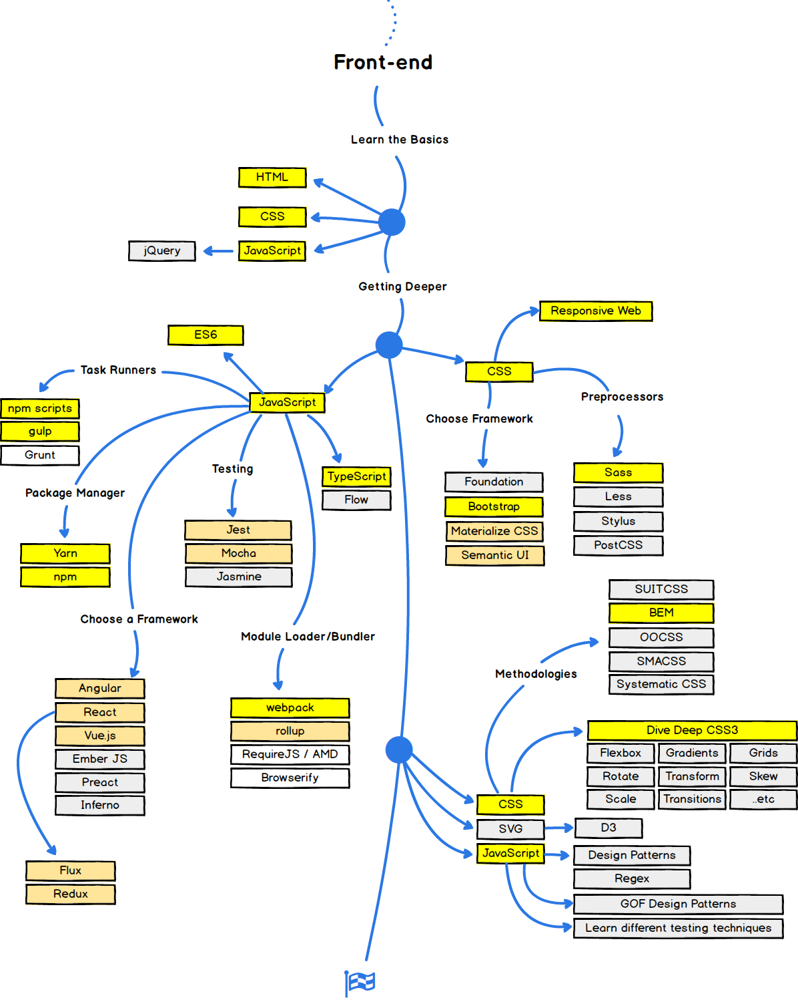

이 글 DevFest의 한성민님의 발표를 정리한 글입니다.

## 오늘날의 프론트엔드

현재 frontend 로드맵을 보기에는 다음과 같이 너무 복잡합니다.

현재 프론트에서의 중요 키워드는 다음과 같습니다.
 
1. 동적 렌더링
2. 모듈링/번들링
3. 타이핑
4. 테스트 자동화

프론트엔드에는 위의 것들을 지원하는 많은 도구들이있습니다.

하지만 이러한 도구들을 사용하기에는 상당히 어려웠습니다.

그러다 프레임워크가 나오게 되었고, 프레임워크는 이를 쉽게 만들어 주었습니다.

### 프레임워크

angular - 완전하고 빠르지만, 진입장벽 높습니다.
react - 활발함 파편화 되어 있어서 의존과 버전에 민감하지만 라이브러리 자체로는 부족합니다.
vue - 가볍고 진입장벽 낮지만, 프로젝트가 커질수록 안좋습니다.

## 프레임워크 톺아보기

Angular는 2016년 6월 Google이 공식 릴리즈 하였습니다.

언어는 Typescript, Dart, Javascript를 사용하며,

모델은 MVVM / Change Detection / NgZone를 사용합니다.

그리고 컴파일 방식은 JIT / AOT / TreeShaking 방식을 사용합니다.

React는 2013년 3월 Facebook이 공식 릴리즈 하였습니다.

언어는 JSX, Javascript를 사용하며,

모델은 View Engine / Virtual DOM / PropTypes를 사용합니다. 

그리고 컴파일 방식은 JIT / TreeShaking 방식을 사용합니다.

Vue는 2014년 2월 Evan You가 공식 릴리즈 하였습니다.

언어는 JSX, Javascript를 사용하며,

모델은 MVVM / Virtual DOM / core와 companion / Vuex를 사용합니다.

그리고 컴파일 방식은 JIT / TreeShaking 방식을 사용합니다.

위의 그림대로 Angular, React, Vue는 각각

Angular는 view와 viewmodel이 서로 분리되어있습니다.

React는 view와 viewmodel이 하나의 class에 속해있다.

Vue는 React와 Angular의 장점들을 모아놓은 것이라고 생각하면 편합니다.

## 진입장벽

진입장벽은 vue가 제일 낮습니다 -> AngularJS를 사용해보았다면 Vue 사용을 권장합니다.

Angular는 진입장벽이 높은편입니다 -> Angular를 사용해보기전 타 프레임워크 경험 권장합니다.

React는 진입장벽은 그리 높은 편은 아니지만, 라이프 사이클과 상태 관리가 어려움

## 성능

성능을 높이는 방법에는 여러 방법이 있습니다.

1. 나무털기 (Angular React Vue 지원)

빌드 단계에서 사용하지 않는 모듈을 나무를 털듯이 제외시키는 방식입니다.

2. AOT (Angular만 지원)

React와 Vue의 JIT 컴파일 방식과는 다르게 브라우저에 부담 최소화하는 방식입니다.

3. VirtualDOM (React Vue 지원)

변경사항을 논리적인 DOM에서 먼저 감지한 후 실제 DOM의 업데이트를 최소화하여 성능 향상시키는 방식입니다.

### 결론 : Angular 최적화가 안되어있다면 Vue가 제일 빠름

### 마무리

뒤의 내용도 있지만, Angular와 Vue에 해당하는 내용을 이해를 못해서 

추후에 공부할 때 다시 포스팅하도록 하겠습니다.