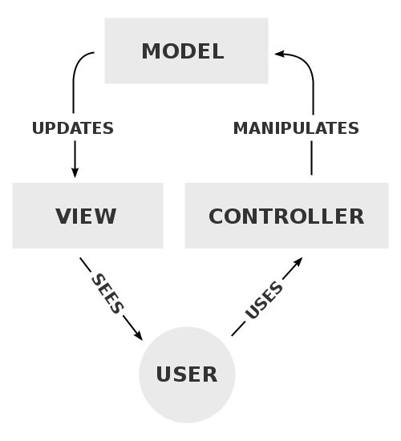

MVC 패턴에 대해서 대략적인 개념은 알고 있으나 자세히 알지 못해서 이번 기회에 공부해보고 싶어 이렇게 포스팅을 합니다.

## MVC 패턴

지난 Flux 아키텍처의 흐름에서 Flux 아키텍처는 MVC 아키텍처의 단점을 보안하고자 나왔다고 설명드렸는데요.

먼저 MVC 패턴은 **디자인 패턴** 중의 하나이고, **Model-View-Controller**의 약자입니다..

```
    여기서 디자인 패턴이란 프로그램을 개발하는 과정에서 발생하는 문제를 정리하여, 상황에 따라 간편하게 적용해서 쓸 수 있는 패턴의 형태로 정리한 것을 말합니다.
```



위의 그림과 같이 **사용자가 Controller를 조작**하게 되면, Controller는 **Model을 통해서** 그 데이터를 가져옵니다.

그 데이터를 바탕으로 **View를 제어**해서 사용자에게 보여줍니다. 

이러한 MVC 패턴은 이름에서 알 수 있듯이 Model과 View와 Controller를 사용하는데요.

각각의 요소를 살펴보도록 하겠습니다.

### **Model**

Model은 한마디로 말하면 **데이터**입니다. 
 
이러한 모델은 사용자가 편집할 수 있는 **모든 데이터**를 가지고 있습니다. 

또한 모델은 **데이터의 변화**가 일어나게 되면 모델은 **UI를 직접 수정하지 않습니다.**

만약 데이터의 변화가 일어나게 된다면 변경에 대한 **처리 방법을 따로 구현**해야 합니다.

### **View** 

View는 이름에서 알 수 있듯이 사용자들에게 보여지는 **인터페이스 요소**를 나타냅니다.

View는 위에서 설명드렸다싶이 Model의 정보를 전달 받는데, 이러한 정보들을 **따로 저장하지 않습니다.**

또한 데이터의 변화가 일어나게 되면 변경에 따른 처리 방법을 따로 구현해야 합니다.

### **Controller**

Controller는 앞에서 잠깐 설명드렸지만, 사용자가 만든 "**이벤트**" 들을 처리하는 부분입니다.

이러한 Controller는 사용자의 이벤트에 따라서 **Model과 View**를 제어합니다.

## MVC 패턴 왜 사용하는가??

### **"그렇다면 이러한 MVC 패턴을 왜사용하는 것일까요?"**

MVC 패턴의 동작 방식에서 알 수 있듯이 **데이터(Model**)와 **사용자에게 보여주는 인터페이스 부분(View)**을 **컨트롤러**를 통해서 **독립적**으로 만들 수 있습니다.

이러한 점에서 MVC 패턴을 사용하고 있습니다.

### **"MVC 패턴이 좋다면 MVC 패턴만 사용하면 될까요?"**

 저번 Flux 아키텍처편에서 말씀드렸다싶이 MVC 패턴도 단점을 가지고 있기 때문에 상황에 맞는 아키텍처를 사용하는 것이 좋습니다.
