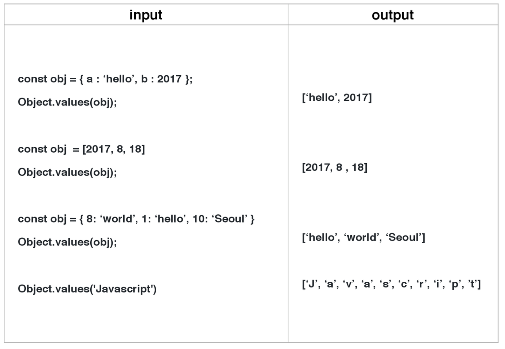
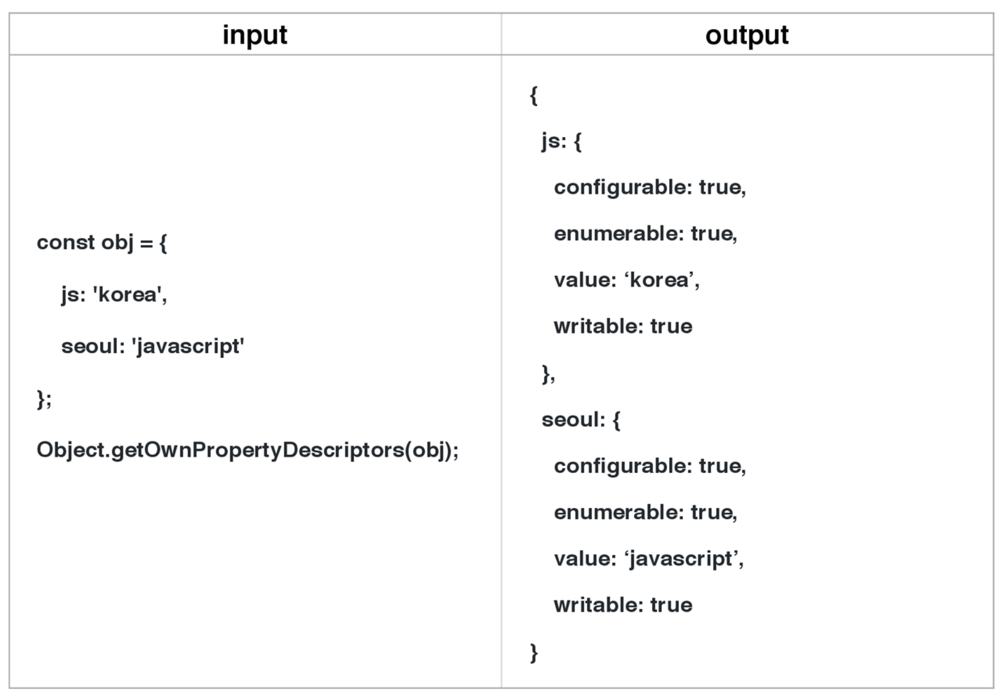
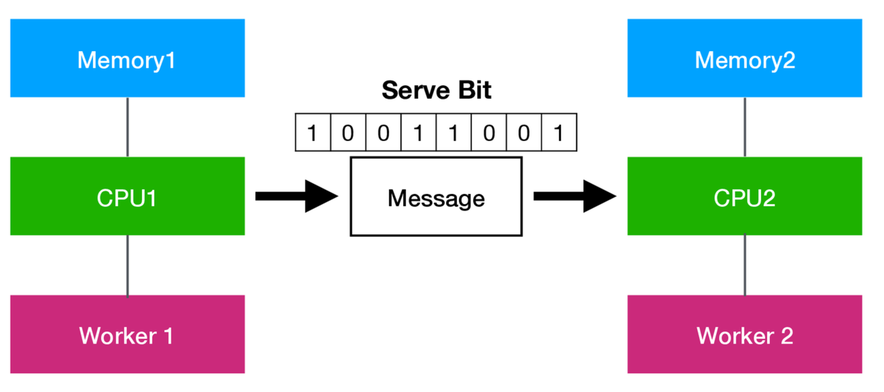

Seoul.js 후기
---

포스팅이 조금 늦었지만, 지난 8월 18일 자바스크립트 컨퍼런스인 Seoul.js에 다녀왔습니다

그곳에서 많은 것을 듣게 되었고, 이것들을 여러분들께 공유하고 싶어서 글을 올립니다!!

Seoul.js의 강의 목차는 다음과 같습니다.
1. ES2017 소개
2. 일렉트론에서 자바스크립트 소스 코드 보호하기(Protecting Javascript Source Code in Electron)
3. 문서화에 날개를 달아주는 Flybook CLI-Static Web Site Generator
4. 새로운 자바스크립트 개발 도구의 시대(Zero-Configuration Tool) - Jimmy Moon

## 시작하기 전에
---

저에게는 이번 컨퍼런스가 다소 어려운 부분이 있어서 **대체적인 내용**만 설명드려야 할 것 같네요....ㅠㅠ 

그리고 제가 이해한 내용이 아닐 수도 있습니다!! 
### 양해부탁드립니다 ㅠㅠ 

만약 틀린부분이 있다면 **페이스북 메신저**를 이용해서 연락을 주시면 감사하겠습니다

(저의 페이스북 주소는 블로그 메인에 나와있습니다)

## ES2017 소개 
---
이번에 나온 ES2017에서의 내용을 설명해 주셨습니다.

업데이트는 **minor 3개**와 **major 2개**가 되었는데요

설명을 드리기 전에 여러분들은 왜 ECMAScript라고 부르는지 아시나요??
```
ECMA는 정보와 통신 시스템을 위한 국제적이면서도 회원국 기반의 비영리 표준화 기구입니다
javascript는 상표라고 할 수 있으므로 문제가 생기기 때문에 
ECMA에서 따와서 ECMAScript라고 지은 것이라고 합니다
```

다시 본론으로 돌아가서 ES2017에 대해서 설명해드리겠습니다.
## minor
---

### 1. Object.values & Object.entries (Friends of Object.keys())

Object.values와 Object.entries는 말 그대로 객체 안의 값들을 가져오는 것입니다



위의 그림처럼 말입니다.

(entris는 key도 나오는 것입니다)

여기서 **한가지 특징**은 Object.values에서 만약 숫자가 key값이라면 **키값으로 sort**를 한 값을 리턴한다는 것입니다

### 2. String padding

String padding은 두가지가 있습니다

1. String.prototype.padStart(maxLength[, fillString]) 
2. String.prototype.padEnd(maxLength[, fillString])


위의 그림처럼 문자열 앞, 뒤를 padding처럼 fillString으로 채우는 것입니다

### 3. Object.getOwnPropertyDescriptors(Friends of Object.getOwnPropertyDescriptors(obj, prop))

이것은 아래의 표처럼 객체의 프로퍼티를 추가한 객체를 리턴하는 것입니다.



## major
---
    
### 1. Async functions
**promise**를 개선한 **Async**가 드디어 나오게 되었습니다

설명을 드리고 싶지만 promise와 Async에 대한 이해가 부족해서 설명을 못드리겠습니다 죄송합니다 ㅠㅠ

나중에 다시 포스팅을 하겠습니다

### 2. Shared memory and atiomics



그림과 같이 **메모리를 공유할 때**가 있습니다

기존에 있던 **ArrayBuffer**는 buffer의 역할을 했지만 다른 worker들과 공유 불가능했습니다.

하지만 **SharedArrayBuffer**는 worker들과의 공유가 가능합니다.

Shared memory를 사용해서 계산할 때, **잘못된 결과**가 나올 수 있습니다.

이것을 미연에 **방지**하는 것이 **atomic**입니다

## 일렉트론에서 자바스크립트 소스 코드 보호하기
---

electron이라는 기술은 이번 강의에 대해서 처음 듣게 되었습니다.

(일렉트론에 대해서는 추후에 포스팅을 할 예정입니다!!)

후에 알게된 이야기지만 지금 많은 데스크탑앱이 electron을 이용해서 개발되었다는 것을 알게 되었습니다.

이러한 electron을 통해서 개발된 데스크탑앱은 **보안에 취약하다**는 문제점이 있습니다.

로그인 토큰, 로그인 정보를 로컬에 저장하는 것과 서버와의 접속 방식, 중요한 비즈니스 로직 등 보안이 필요한 경우가 있습니다.

electron은 **arsar 처리**와 **uglify**등의 방법으로 보안을 하지만 사실상 **보안의 의미**가 없다고 합니다. 

그래서 사용하는 방법이 zeit/pkg를 사용합니다.

만약 **Node.js를 패키징**을 하면 Node.js가 설치되지 않은 장치에서도 실행할 수 있는 **실행파일을 만들줍니다**.

이러한 방법으로 electron에서 소스 코드를 보호할 수 있다고 합니다.

하지만 zeit/pkg에도 단점이 존재합니다.

1. 코드가 많아진다/ 코드를 관리하기 힘들다
2. 용량도 커진다.
3. 엔진 성능 이슈

하지만 위의 단점들은 보안할 수 있다고 합니다. 

특히 성능에 관한 단점은 브라우저의 성능이 더 중요하기 때문에 단점이라고 보기 어렵다고 합니다. 
<!--일레트론 웹기술로 데스크탑 어플리케이션을 개발할 수 있는 오픈소스 프레임워크  
        메인프로세스와 랜터러 프로세스
            메인은 node.js라고 생각
            랜더러는 각각 크롬브라우저
            메인은 하나 랜더러는 창마다
    protoPie-디자이너를 위한 인터렉션 프로토타이핑 도구 현재 개발중 소스보호를 위해서 enclosejs,pkg 사용 /자동업데이트 서버 zeit/하젤??..
    일렉트론은 보완이 취약
        필요한 경우 (로그인 토큰 로그인 정보 로컬 저장, 서버와의 접속 방식, 기타 중요하다고 생각하는 비즈니스 로직) 필요하지 않은 경우(인증을 동적으로 받아 처리하는 경우 브라우저 처럼)
    asar 처리
        asar pack
        asar extract
        사실상 보안의 의미 없음
    uglify
        자바스크립트라면 기본
        beautify(이런것들은 보안 x)
    enclosejs
        use case 소스 보호
            노드프로젝트가 하나의 바이너리파일로 변환 -> enclosejs 서비스 중단..
    zeit/pkg(오픈소스)
        Node.js 프로젝트를 패키징 -> Node.js가 설치되지 않은 장치에서도 실행할수있는 실행파일을 만들어주는 커맨드라인 인터페이스
        process의 분리와 node-ipc와 통신(node-ipc???..)
        코드사이닝??
        puppet..?
        TypeScript??...
        .ts..?
        단점
            코드가 많아진다 코드관리 어려움 -> 타입스크립트
            용량도 커진다
            엔진 성능 이슈 https://github.com/zeit/pkg/issues/74
            ipc 성능 이슈 컨텍스트보다는 느리지만 실제로는 브라우저에서의 성능이 더관건이다.
        vm api-->

## 문서화에 날개를 달아주는 Flybook CLI-Static Web Site Generator 
---

이번 발표에서는 개념의 대한 설명보다는 발표자님께서 개발중이신 Flybook에 대해서 설명해 주셨습니다.    

flybook은 md파일로 되어있는 api문서를 html로 바꾸어주는 툴입니다.

여러분들도 한번 써보시는 것을 추천합니다!!

## 새로운 자바스크립트 개발 도구의 시대(Zero-Configuration Tool) - Jimmy Moon
---

    자바스크립트를 사용하다보면 여러가지 개발 도구를 사용합니다.

    이러한 개발 도구들을 
    큰 어플리케이션을 만들게 되면서 등장
    boilerplates, starter-kits
    lint formatting

## 마무리
---
처음 자바스크립트라는 언어는 단지 정적인 웹페이지를 동적으로 바꾸어 주는 언어였습니다. 하지만 이제는 거의 모든 것을 할 수 있는 언어라고 느끼게 되는 컨퍼런스였습니다

아직도 많이 부족하다는 것을 다시 한번 깨닫게 되었고, 앞으로 더욱더 열심히 하겠습니다!!

### 화이팅!! :)